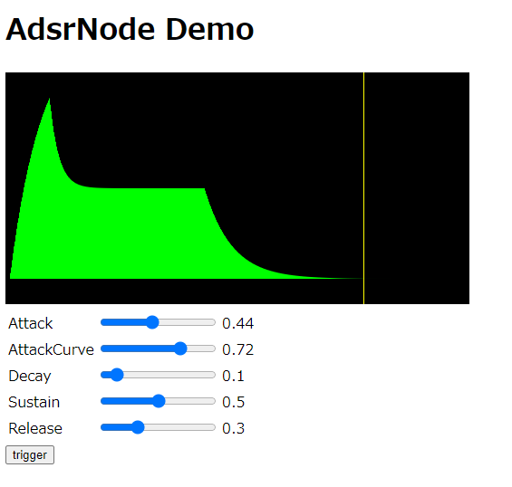

# audioworklet-adsrnode

**AdsrNode**  is a Web Audio API's audio node that generates an ADSR envelope waveform implemented using AudioWorklet.  
Envelope waveform is output by inputting key on/off signal to trigger parameter.

[Live Demo](https://g200kg.github.io/audioworklet-adsrnode/test.html)

## Output
The output is the ADSR curve triggered by the 'trigger' parameter.  
The peak of attack curve is always 1.0 and in the range [0, 1].

## Paramters

### trigger
The trigger input. When a positive edge is input whose value crosses 0.5, the envelope will be triggered.

### attack
It is the time in seconds until the attack curve reaches its peak.

### attackcurve
Specifies whether the attack curve is a straight line or an exponential curve. A range of 0 to 1, with 0 being a straight line and 1 being a near flat peak.

### decay
The time it takes for the decay curve to approach the sustain value. Since the decay curve is an asymptote, it represents the time in seconds from the peak to approaching 63.2% toward the sustain value.

### sustain
The value of the target where the decay curve is approaching. Specify in the range of 0 to 1.

### release
The time it takes for the release curve to approach 0. Since the release curve is an asymptote, it represents the time in seconds to reach 63.2% toward 0.

## Usage

To use adsrnode, you must first add "audioworklet-adsrnode.js" to Load. This is the only file you need.  

``  

Next, Initialize and register the AdsrNode for use :  

`AdsrNode.Initialize(audioContext)`  

Initialization requires an audio context that uses AdsrNode. Note that `Initialize()` returns a `Promise`. The `AdsrNode` will only be available after this Promise has been resolved.

Create `AdsrNode` by :  
`adsr = new AdsrNode(audioContext)`

Initialize options are also available. For examples :  
`adsr = new AdsrNode(audioContext, {attack:0.5, attackcurve:0, decay:0.2, sustain:0.1, release:0.8});`

See **[livedemo](https://g200kg.github.io/audioworklet-adsrnode/test.html)** for the actual behavior

